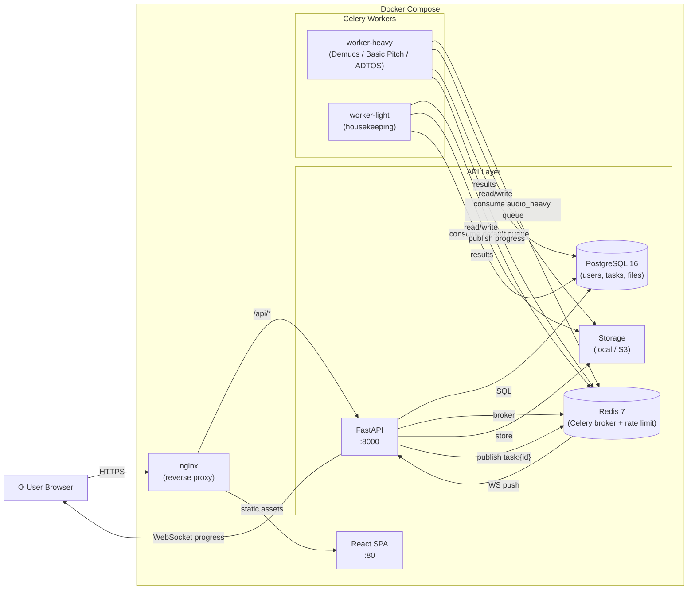
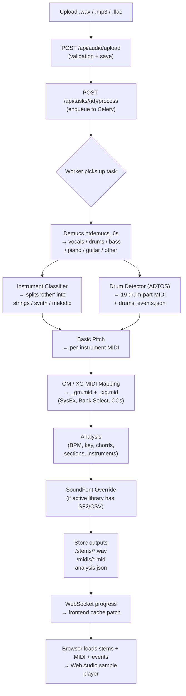

# music-ai

[English](./README.md) | [简体中文](./README.zh-CN.md)

AI-powered music processing app: upload an audio file, process it in a Celery
worker, then inspect separated stems, per-instrument MIDI files, GM/XG-mapped
drum kits and rule-based music analysis in the web UI. The pipeline covers the
core audio-AI loop end-to-end (source separation -> transcription -> drum
splitting -> GM/XG MIDI -> user-supplied sample playback -> SoundFont/CSV voice
override) and ships with the five product-grade features described in
[`FEATURES.md`](./FEATURES.md).

## What Works Now

- FastAPI backend with upload, task list/detail, processing, status, stems, analysis and sample-library endpoints.
- Celery worker backed by Redis for long-running audio jobs, with a 30-minute task time limit + soft-time-limit cleanup and a dead-letter queue for failed tasks.
- PostgreSQL schema managed by Alembic migrations; CI runs the test suite against real Postgres (not just SQLite).
- React/Vite frontend for uploading files, following progress, downloading outputs, browsing drum parts and managing sample libraries. Route-level code splitting keeps the initial bundle small.
- 6-stem Demucs separation (`htdemucs_6s`: vocals / drums / bass / piano / guitar / other), per-instrument Basic Pitch MIDI with full GM controllers (CC7/CC10/CC11/CC64/CC74/CC91/CC93/CC1, pitch bend), and a 19-part drum detector that emits per-part MIDI plus a JSON event list for the browser-side sample player.
- GM/XG MIDI mapping: generates both `_gm.mid` and `_xg.mid` variants with correct SysEx reset, Bank Select, Program Change, and per-stem expressive CCs. XG melodic variations (Live! Grand Piano, Stereo Strings) and XG Standard Kit (bank 127:0) for drums.
- Velocity-layered sample libraries: filenames like `kick_pp.wav` / `snare_ff.wav` / `kick_vel_001_064.wav` / `snare_v51-100.wav` map to MIDI velocity ranges so the front-end picks the right sample per hit strength.
- SoundFont & CSV preset table import: upload SF2 files (parsed via sf2utils with simplified fallback) or electronic-keyboard CSV voice tables; GM -> custom preset mapping via instrument_type match, program match, or fuzzy name similarity.
- Sample auto-classification: when a filename doesn't match known aliases, spectral analysis (centroid, peak freq, rolloff, ZCR, harmonicity, attack ratio) classifies the drum type and assigns the correct GM note.
- A web-audio sample player that decodes user-uploaded drum samples and re-renders the detected hits through the active sample library, with velocity-layer selection.
- Local fallback paths for development when Demucs or Basic Pitch cannot produce full-quality output.
- **User accounts**: bcrypt + HS256 JWTs (access + refresh), per-user task ownership, per-user quotas (active tasks + upload bytes). Auth is **opt-in** via `AUTH_REQUIRED` so existing e2e keeps working; flip it on in any environment real users can reach.
- **Live progress over WebSocket**: `WS /api/ws/tasks/{id}/progress` publishes a `snapshot` then relays every `task:{id}` pub/sub message from the worker. The frontend patches the React Query cache in place --- no more "wait 1.5 s for the next poll". Per-IP connection cap and ownership check enforced.
- **Health probes + metrics**: `GET /healthz` (liveness), `GET /readyz` (probes Postgres + Redis), `GET /metrics` (Prometheus exposition with a per-status task gauge).
- **LLM commentary**: `llm_service.py` ships a mock provider and an OpenAI-compatible provider, rendered in the UI as a `CommentaryCard`.
- **i18n + dark mode**: react-i18next (zh/en) with localStorage persistence; class-based dark mode with cross-tab sync.
- **Security hardening**: Redis-backed rate limiting on login/register/upload/task endpoints, zip-bomb protection, upload size limits, non-root Docker user, Docker compose resource limits (CPU + memory).
- **CI on every PR**: GitHub Actions runs the backend pytest suite against Postgres + Redis service containers, runs the frontend Vitest unit tests, type-checks + builds the frontend, and runs the Playwright e2e flow.
- **Production deployment docs**: see [`DEPLOY.md`](./DEPLOY.md) for the compose path and the bare-metal systemd + nginx path, plus a production hardening checklist.

## Architecture



### Audio Processing Pipeline



### Directory Layout

- `frontend/` - React, Vite, TanStack Query, Tailwind CSS.
- `backend/` - FastAPI API, SQLAlchemy models, Alembic migrations and Celery worker.
- `scripts/` - local database bootstrap and smoke/e2e checks.
- `storage/` - ignored local uploads and generated artifacts.
- `docs/` - additional documentation and interview guide.

Processing flow:

1. `POST /api/audio/upload` stores the audio under `storage/uploads/<task_id>/`.
2. `POST /api/tasks/{task_id}/process` queues a Celery job.
3. The worker:
   - runs Demucs -> 6 stems (vocals / drums / bass / piano / guitar / other)
   - runs the instrument classifier on `other` -> per-instrument stems (strings / synth / other_melodic)
   - runs Basic Pitch -> per-instrument MIDI with full GM controllers
   - runs the drum detector -> 19 per-part MIDI files + `drums_events.json`
   - maps GM/XG variants -> `_gm.mid` + `_xg.mid` with SoundFont overrides if active
   - writes `analysis.json` (BPM, key, chords, sections, detected instruments, soundfont overrides)
4. The frontend receives live progress via WebSocket (with polling fallback), then loads `/stems`, `/analysis`, and (when an active sample library is set) decodes `drums_events.json` plus the library's samples through the Web Audio API.

## Screenshots

> 📸 Run the app (`docker compose up --build`) and add your own screenshots to `docs/screenshots/`.
> See [docs/screenshots/README.md](./docs/screenshots/README.md) for suggested filenames and capture tips.
>
> Suggested views: Upload page, live processing progress, stem mixer with results, sample library management, dark mode.

## Quick Start With Docker

One command brings up **everything** (Postgres, Redis, API, both Celery workers, and the React frontend served by nginx):

```bash
cp .env.example .env
docker compose up --build
```

Wait ~30 seconds for the Alembic migration and all healthchecks to pass, then open:

- **Frontend UI**: http://127.0.0.1:8080 (nginx serves the built React SPA and proxies `/api/*` to the backend)
- **API + Swagger UI**: http://127.0.0.1:8000/docs
- **Metrics**: http://127.0.0.1:8000/metrics

Ports can be customized via `.env` (`FRONTEND_PORT`, `BACKEND_PORT`).

To run the frontend in dev mode (with hot reload) against Docker-hosted API/DB/Redis:

```bash
cd frontend
npm install
npm run dev
```

Open `http://127.0.0.1:5173`.

## Local Development

Start infrastructure:

```bash
docker compose up -d postgres redis
```

Install backend dependencies and migrate the database:

```bash
cd backend
python -m venv .venv
source .venv/bin/activate
pip install -r requirements.txt
cd ..
python scripts/init_db.py
```

Run the API and worker in separate terminals:

```bash
cd backend
uvicorn app.main:app --reload
```

```bash
cd backend
celery -A app.celery_app:celery worker --loglevel=info --concurrency=1
```

Run the frontend:

```bash
cd frontend
npm install
npm run dev
```

## Verification

With backend dependencies installed:

```bash
cd backend
.venv/bin/pytest                      # 256 tests covering services, repos, MIDI, drum detection, sample library, soundfont, sample classifier, auth, WebSocket, rate limiting, health
python -m compileall app scripts
```

With frontend dependencies installed:

```bash
cd frontend
npx vitest                            # 16 Vitest unit tests
npm run build                         # type-checks the whole TS tree
```

Useful runtime checks:

```bash
python scripts/check_servers.py
python scripts/smoke_test.py
python scripts/e2e_tasks.py
python scripts/e2e_midi.py
```

The e2e scripts start their own API and worker on port `8000`, so close any
manual backend process first.

## Environment

Copy `.env.example` to `.env` and adjust as needed.

- `DATABASE_URL` overrides individual `DB_*` settings.
- `STORAGE_DIR` is the preferred single root for uploads, outputs and sample libraries.
- `UPLOAD_DIR` and `OUTPUT_DIR` can override the derived storage subfolders.
- `SAMPLE_LIBRARY_DIR` is the per-library upload root; defaults to `<STORAGE_DIR>/sample-libraries`.
- `MAX_UPLOAD_BYTES` defaults to `209715200` (200 MB). Sample library uploads are capped at 5 MB per file / 80 MB total.
- `REDIS_URL` feeds Celery broker/result defaults.
- `CORS_ORIGINS` is a comma-separated list for browser clients.

## API Highlights

- `GET  /api/audio/tasks` / `/api/audio/tasks/{id}` --- task list & detail.
- `POST /api/audio/upload` --- multipart upload.
- `POST /api/tasks/{id}/process` --- enqueue the pipeline.
- `GET  /api/tasks/{id}/stems` / `/analysis` --- outputs.
- `GET  /api/instruments/libraries` / `POST /api/instruments/libraries` / `POST /api/instruments/libraries/{id}/activate` --- sample library CRUD (multi-file or zip upload, filename aliasing + spectral auto-classification to GM notes).
- `GET  /api/instruments/active` --- currently active library.
- `GET  /api/instruments/libraries/{id}/files/{note}` --- fetch a single sample.
- `POST /api/instruments/soundfont/import` --- upload SF2 file, extract presets, save to database.
- `POST /api/instruments/preset-table/import` --- upload CSV electronic-keyboard voice table.
- `GET  /api/instruments/soundfonts` / `POST /api/instruments/soundfonts/{id}/activate` --- SoundFont CRUD + activation.
- `GET  /api/instruments/gm-instruments` --- list 128 GM program numbers with standard names.
- `GET  /api/instruments/drum-types` --- list all supported drum types with GM notes.
- `WS   /api/ws/tasks/{id}/progress` --- live progress stream (snapshot + Redis pub/sub relay).

## Current Gaps

- Demucs and Basic Pitch are heavy; first production-quality processing can be slow on CPU-only machines.
- Uploaded files are stored locally; production needs object storage or a managed persistent volume strategy.
- Frontend test coverage is limited to pure utils and the API client layer; component-level tests are still TODO.

See [`FEATURES.md`](./FEATURES.md) for the full product-level feature breakdown.
