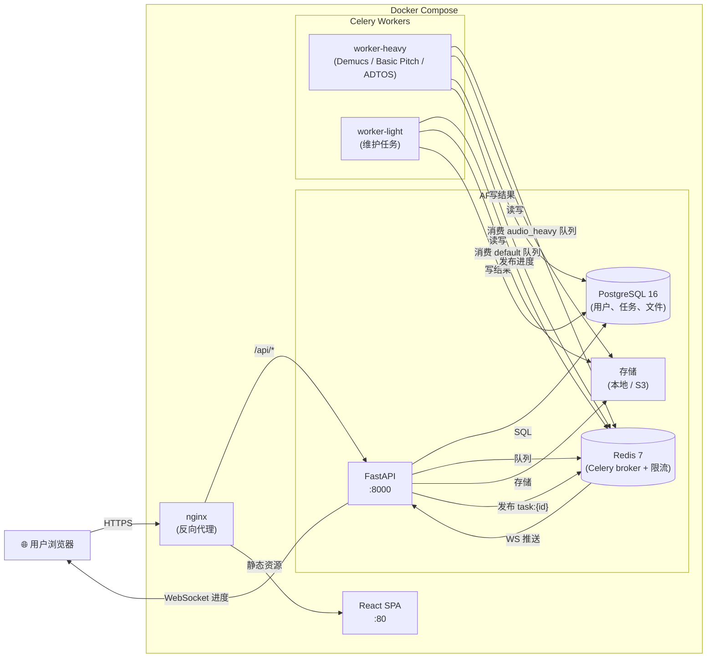
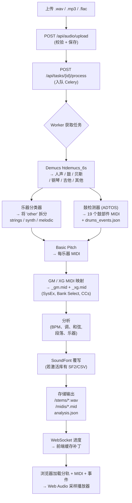

# music-ai

[English](./README.md) | [简体中文](./README.zh-CN.md)

AI 驱动的音乐处理应用：上传音频文件，由 Celery Worker 异步处理，然后在 Web UI 中查看分轨结果、各乐器 MIDI 文件、GM/XG 映射鼓组以及基于规则的音乐分析。处理流水线端到端覆盖核心音频 AI 循环（音源分离 → 音高转录 → 鼓组拆分 → GM/XG MIDI → 用户采样回放 → SoundFont/CSV 音色覆写），并提供 [`FEATURES.md`](./FEATURES.md) 中描述的五项产品级功能。

## 当前功能

- FastAPI 后端，提供上传、任务列表/详情、处理、状态、分轨、分析和采样库端点。
- 基于 Redis 的 Celery Worker 处理长时间运行的音频任务，30 分钟任务时间限制 + 软时间限制清理，以及用于失败任务的死信队列。
- 由 Alembic 迁移管理的 PostgreSQL schema；CI 针对真实 Postgres（不只是 SQLite）运行测试套件。
- React/Vite 前端，用于上传文件、跟踪进度、下载输出、浏览鼓部件和管理采样库。路由级代码分割保持初始 bundle 精简。
- 6 轨 Demucs 分离（`htdemucs_6s`：人声 / 鼓 / 贝斯 / 钢琴 / 吉他 / 其他），每轨 Basic Pitch MIDI 转录（完整 GM 控制器 CC7/CC10/CC11/CC64/CC74/CC91/CC93/CC1、弯音），19 部件鼓检测器输出每部件 MIDI + JSON 事件列表供浏览器端采样播放器使用。
- GM/XG MIDI 映射：同时生成 `_gm.mid` 和 `_xg.mid` 变体，包含正确的 SysEx 复位、音色库选择、音色变更和每轨表情 CC。XG 旋律变体（Live! 三角钢琴、立体声弦乐）和鼓组 XG 标准鼓组（音色库 127:0）。
- 力度分层采样库：文件名如 `kick_pp.wav` / `snare_ff.wav` / `kick_vel_001_064.wav` / `snare_v51-100.wav` 映射到 MIDI 力度范围，前端根据击打强度选择正确的采样。
- SoundFont & CSV 预设表导入：上传 SF2 文件（通过 sf2utils 解析，带简化回退）或电子键盘 CSV 音色表；通过 instrument_type 匹配、program 匹配或模糊名称相似度进行 GM → 自定义预设映射。
- 采样自动分类：当文件名不匹配已知别名时，频谱分析（质心、峰值频率、滚降、ZCR、谐波度、起音比）对鼓类型进行分类并分配正确的 GM 音符。
- Web Audio 采样播放器，解码用户上传的鼓采样，通过活动采样库重新渲染检测到的击打，支持力度分层选择。
- 当 Demucs 或 Basic Pitch 无法生成完整质量输出时，提供本地开发回退路径。
- **用户账户**：bcrypt + HS256 JWT（access + refresh），每用户任务所有权，每用户配额（活动任务数 + 上传字节数）。认证通过 `AUTH_REQUIRED` 可选启用，因此现有 e2e 测试继续工作；在任何真实用户可访问的环境中开启。
- **WebSocket 实时进度**：`WS /api/ws/tasks/{id}/progress` 发布 `snapshot` 后中继 Worker 发出的每条 `task:{id}` 发布/订阅消息。前端就地补丁 React Query 缓存——无需"等待 1.5 秒轮询"。强制执行每 IP 连接数上限和所有权检查。
- **健康探针 + 指标**：`GET /healthz`（存活）、`GET /readyz`（探测 Postgres + Redis）、`GET /metrics`（Prometheus 导出，含按状态任务仪表）。
- **LLM 评论**：`llm_service.py` 提供 Mock Provider 和 OpenAI 兼容 Provider，在 UI 中渲染为 `CommentaryCard`。
- **i18n + 暗色模式**：react-i18next（中/英），localStorage 持久化；class-based 暗色模式，跨标签页同步。
- **安全加固**：Redis 支持的登录/注册/上传/任务端点限流，zip 炸弹防护，上传大小限制，非 root Docker 用户，Docker Compose 资源限制（CPU + 内存）。
- **每次 PR 的 CI**：GitHub Actions 运行后端 pytest 套件（Postgres + Redis 服务容器），运行前端 Vitest 单元测试，类型检查 + 构建前端，运行 Playwright e2e 流程。
- **生产部署文档**：参见 [`DEPLOY.md`](./DEPLOY.md) 了解 Compose 路径和裸金属 systemd + nginx 路径，以及生产加固清单。

## 架构



### 音频处理流水线



### 目录结构

- `frontend/` - React, Vite, TanStack Query, Tailwind CSS。
- `backend/` - FastAPI API, SQLAlchemy 模型, Alembic 迁移和 Celery Worker。
- `scripts/` - 本地数据库初始化和 smoke/e2e 检查。
- `storage/` - gitignore 的本地上传和生成产物。
- `docs/` - 附加文档和面试指南。

处理流程：

1. `POST /api/audio/upload` 将音频存储在 `storage/uploads/<task_id>/` 下。
2. `POST /api/tasks/{task_id}/process` 将 Celery 任务入队。
3. Worker:
   - 运行 Demucs → 6 个分轨（人声 / 鼓 / 贝斯 / 钢琴 / 吉他 / 其他）
   - 在 `other` 上运行乐器分类器 → 每乐器分轨（strings / synth / other_melodic）
   - 运行 Basic Pitch → 带完整 GM 控制器的每乐器 MIDI
   - 运行鼓检测器 → 19 个每部件 MIDI 文件 + `drums_events.json`
   - 映射 GM/XG 变体 → `_gm.mid` + `_xg.mid`，若有激活 SoundFont 则进行覆写
   - 写入 `analysis.json`（BPM、调、和弦、段落、检测到的乐器、SoundFont 覆写）
4. 前端通过 WebSocket 接收实时进度（轮询回退），然后加载 `/stems`、`/analysis`，在设置活动采样库时通过 Web Audio API 解码 `drums_events.json` 和库的采样。

## 截图

> 📸 运行应用 (`docker compose up --build`) 后将截图添加到 `docs/screenshots/` 目录。
> 建议的文件名和截图技巧参见 [docs/screenshots/README.md](./docs/screenshots/README.md)（英文）。
>
> 建议截图页面：上传页、实时处理进度、分轨混音器结果页、采样库管理、暗色模式。

## Docker 快速开始

一条命令启动**所有服务**（Postgres、Redis、API、两个 Celery Worker，以及 nginx 托管的 React 前端）：

```bash
cp .env.example .env
docker compose up --build
```

等待约 30 秒让 Alembic 迁移和所有健康检查通过，然后打开：

- **前端 UI**：http://127.0.0.1:8080（nginx 托管构建后的 React SPA，并将 `/api/*` 反向代理到后端）
- **API + Swagger UI**：http://127.0.0.1:8000/docs
- **指标**：http://127.0.0.1:8000/metrics

端口可通过 `.env` 自定义（`FRONTEND_PORT`、`BACKEND_PORT`）。

要在开发模式（热重载）下运行前端对接 Docker 托管的 API/DB/Redis：

```bash
cd frontend
npm install
npm run dev
```

打开 `http://127.0.0.1:5173`。

## 本地开发

启动基础设施：

```bash
docker compose up -d postgres redis
```

安装后端依赖并迁移数据库：

```bash
cd backend
python -m venv .venv
source .venv/bin/activate
pip install -r requirements.txt
cd ..
python scripts/init_db.py
```

在单独终端运行 API 和 Worker：

```bash
cd backend
uvicorn app.main:app --reload
```

```bash
cd backend
celery -A app.celery_app:celery worker --loglevel=info --concurrency=1
```

运行前端：

```bash
cd frontend
npm install
npm run dev
```

## 验证

安装后端依赖后：

```bash
cd backend
.venv/bin/pytest                      # 256 个测试覆盖 services、repos、MIDI、鼓检测、采样库、soundfont、采样分类、auth、WebSocket、限流、健康检查
python -m compileall app scripts
```

安装前端依赖后：

```bash
cd frontend
npx vitest                            # 16 个 Vitest 单元测试
npm run build                         # 对整个 TS 树进行类型检查
```

有用的运行时检查：

```bash
python scripts/check_servers.py
python scripts/smoke_test.py
python scripts/e2e_tasks.py
python scripts/e2e_midi.py
```

e2e 脚本会在 `8000` 端口启动自己的 API 和 Worker，因此请先关闭手动启动的后端进程。

## 环境变量

复制 `.env.example` 到 `.env` 并按需调整。

- `DATABASE_URL` 覆盖单个 `DB_*` 设置。
- `STORAGE_DIR` 是上传、输出和采样库的首选根目录。
- `UPLOAD_DIR` 和 `OUTPUT_DIR` 可以覆盖派生的存储子文件夹。
- `SAMPLE_LIBRARY_DIR` 是每个库的上传根目录；默认为 `<STORAGE_DIR>/sample-libraries`。
- `MAX_UPLOAD_BYTES` 默认为 `209715200`（200 MB）。采样库上传限制为每文件 5 MB / 总计 80 MB。
- `REDIS_URL` 提供 Celery broker/result 默认值。
- `CORS_ORIGINS` 是浏览器客户端的逗号分隔列表。
- `LOG_LEVEL`：日志级别（DEBUG / INFO / WARNING / ERROR / CRITICAL），默认 INFO。
- `LOG_JSON`：设为 `true` 输出 JSON 结构化日志（适合 ELK/Loki/Datadog），默认 `false`（彩色文本，适合本地开发）。

## API 一览

- `GET  /api/audio/tasks` / `/api/audio/tasks/{id}` --- 任务列表和详情。
- `POST /api/audio/upload` --- multipart 上传。
- `POST /api/tasks/{id}/process` --- 入队处理流水线。
- `GET  /api/tasks/{id}/stems` / `/analysis` --- 输出文件。
- `GET  /api/instruments/libraries` / `POST /api/instruments/libraries` / `POST /api/instruments/libraries/{id}/activate` --- 采样库 CRUD（多文件或 zip 上传，文件别名 + 频谱自动分类到 GM 音符）。
- `GET  /api/instruments/active` --- 当前激活的库。
- `GET  /api/instruments/libraries/{id}/files/{note}` --- 获取单个采样。
- `POST /api/instruments/soundfont/import` --- 上传 SF2 文件，提取预设，保存到数据库。
- `POST /api/instruments/preset-table/import` --- 上传 CSV 电子键盘音色表。
- `GET  /api/instruments/soundfonts` / `POST /api/instruments/soundfonts/{id}/activate` --- SoundFont CRUD + 激活。
- `GET  /api/instruments/gm-instruments` --- 列出 128 个 GM program 号及标准名称。
- `GET  /api/instruments/drum-types` --- 列出所有支持的鼓类型及 GM 音符。
- `WS   /api/ws/tasks/{id}/progress` --- 实时进度流（快照 + Redis pub/sub 中继）。

## 当前待完善

- Demucs 和 Basic Pitch 比较重；首次生产质量处理在纯 CPU 机器上可能较慢。
- 上传文件存储在本地；生产环境需要对象存储或托管持久卷策略。
- 前端测试覆盖限于纯工具函数和 API client 层；组件级测试仍在 TODO 中。

完整的产品级功能分解参见 [`FEATURES.md`](./FEATURES.md)。
